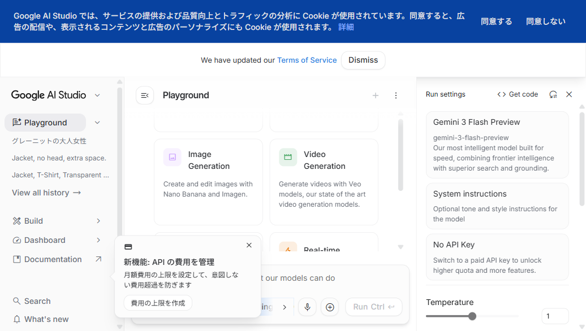
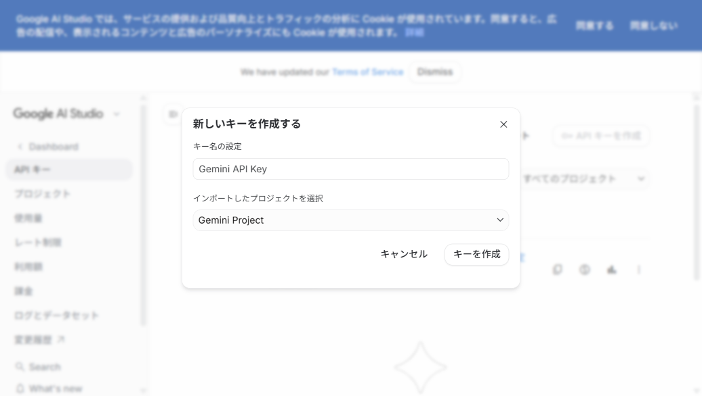
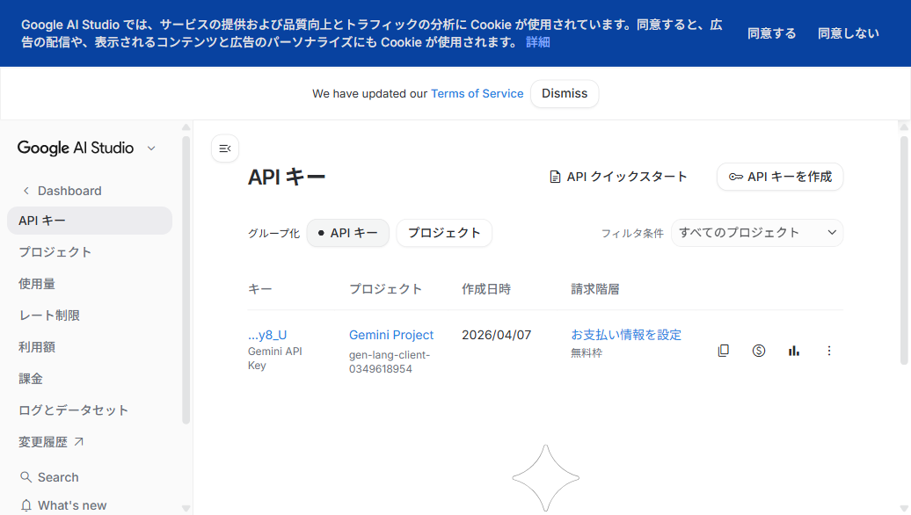

# Gemini API Key 取得ガイド

note記事ライターを使うには、GoogleのGemini API Key（無料）が必要です。
このガイドでは、取得からツールへの設定までを画像付きで説明します。

**所要時間: 約2分**
**費用: 無料（Gemini 2.0 Flashは無料枠で利用可能）**

---

## Step 1: Google AI Studio にアクセス

ブラウザで以下のURLを開いてください。

**https://aistudio.google.com/**

Googleアカウントでログインすると、以下のような画面が表示されます。



> Googleアカウントを持っていない場合は、先にGoogleアカウントを作成してください。

---

## Step 2: API キーのページに移動

左サイドバーの **「Get API key」** または **「API キー」** をクリックします。

または、直接以下のURLにアクセスしてください。

**https://aistudio.google.com/apikey**


---

## Step 3: API キーを作成

右上の **「API キーを作成」** ボタンをクリックします。

以下のダイアログが表示されます。



- **キー名の設定**: そのままでOK（「Gemini API Key」）
- **プロジェクト**: そのままでOK（「Gemini Project」）

**「キーを作成」** ボタンをクリックすると、API Keyが生成されます。

---

## Step 4: API キーをコピー

作成されたキーの右側にある **コピーボタン（四角が重なったアイコン）** をクリックします。



> キーは `AIza...` で始まる長い文字列です。
> このキーは他の人に共有しないでください。

---

## Step 5: note記事ライターに貼り付け

note記事ライターを起動して、左サイドバーの **「Gemini API Key」** 欄にコピーしたキーを貼り付けます。


貼り付けたら、すぐにツールが使えるようになります。

---

## ツールの起動方法

```bash
cd note-writer-tool
python -m streamlit run app.py
```

ブラウザで **http://localhost:8501** が自動的に開きます。

---

## よくある質問

### Q: 本当に無料ですか？
**A: はい。** Gemini 2.0 Flashには無料枠があり、個人利用であれば十分な量を無料で使えます。クレジットカードの登録も不要です。

### Q: API Keyは毎回入力する必要がありますか？
**A: はい。** セキュリティのため、ブラウザを閉じるとリセットされます。API Keyをメモ帳などに保存しておくと便利です。

### Q: 「レート制限」と表示されました
**A:** 無料枠には1分あたりのリクエスト数に制限があります。少し時間を置いてから再度試してください。

### Q: API Keyが無効と表示されます
**A:** Google AI Studio（https://aistudio.google.com/apikey）でキーが有効か確認してください。無効な場合は新しいキーを作成してください。
